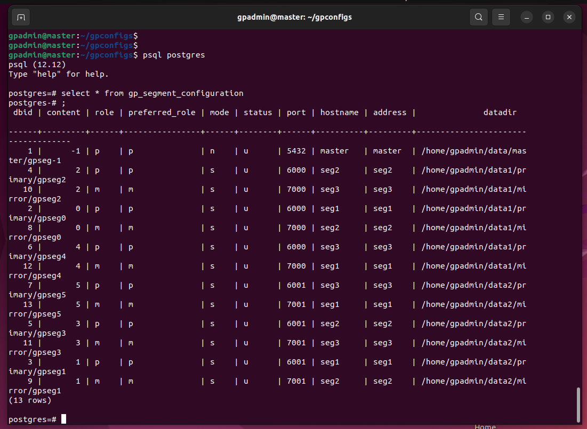

# Развёрнутый кластер **Greenplum Database** — massively parallel processing (MPP) СУБД для аналитики больших данных.

## Архитектура кластера

- **1 координатор(мастер)** - управление кластером
- **3 сегментной ноды** - хранение и параллельная обработка данных

## Инструкция по развёртыванию - [SETUP.md](SETUP.md)
## Конфигурационный файл - [gpinitsystem_config](gpinitsystem_config)

При успещном развёртовании на консоле дожен быть следующий вывод

